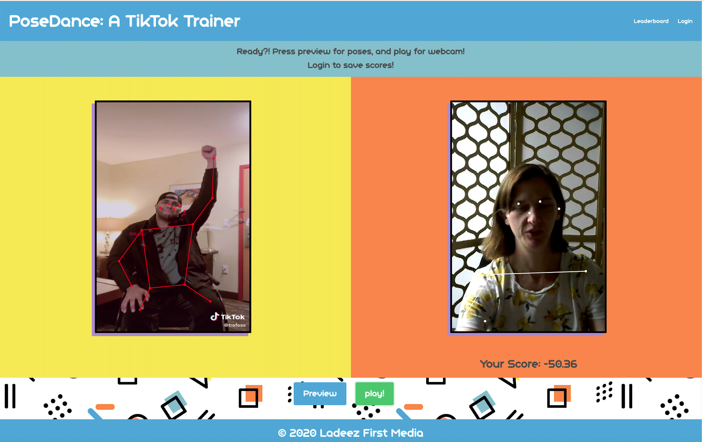

# PoseDance - Perfect your Dance Moves with a friendly TikTok Trainer!

## Welcome to PoseDance!



PoseDance is your friendly TikTok trainer. It uses embedded videos downloaded from TikTok with PoseNet running on top, enabling the drawing of a 'skeleton' as each frame of a video is analyzed. Match your webcam's output to the video and get a high score!

This project is built using Vue.js with PoseNet installed as an npm package. This allows use of the TensorFlow-built models to be used via TensorFlow.js in the web app. It also makes the app PRETTY BIG, especially as you need to analyze two models, one for the video from TikTok, and one for your webcam.

For its backend it also uses [PlayFab](https://playfab.com), a great PAAS for games. Register and login to record your high score!

It's hosted on [Azure Static Web Sites](https://aka.ms/trystaticwebapps), a nice way to host your static web apps and SPAS like this one.

> You can read more about how to build and host Azure Static Sites on the Microsoft [Docs](https://docs.microsoft.com/azure/static-web-apps/overview?WT.mc_id=academic-5207-jelooper). You can also walk through how to publish your static sites to Azure on Microsoft [Learn](https://docs.microsoft.com/en-us/learn/modules/publish-app-service-static-web-app-api?WT.mc_id=academic-5207-jelooper).

---

## Learn about the codebase

This repo has a Code Tour! What's a Code Tour, you ask? It's a neat little [Visual Studio Code extension](https://marketplace.visualstudio.com/items?itemName=vsls-contrib.codetour&WT.mc_id=academic-0000-jelooper#recording-tours) that, if installed locally, will allow you to view the code tour that I created to step through the code. Install that extension in VS Code and give it a try!

## Try the app!

You can try the app live [here](https://aka.ms/posedance).

## Blogpost

Blogpost coming soon!

## Video

Watch a [video explanation](https://www.dropbox.com/s/ccog8uz0tzk10mv/posedance.mp4?dl=0) of the technology behind the silliness.

## Slides

Download a PowerPoint presentation on this project [here](posedance.pptx).

## Behind the Scenes

Learn more about PoseNet [here](https://github.com/tensorflow/tfjs-models/tree/master/posenet/demos).

---

## FAQ:

**Where can I learn more about TensorFlow.js?**

Check out their [docs](https://www.tensorflow.org/js/) and try some [tutorials](https://www.tensorflow.org/js/tutorials) and [CodeLabs](https://codelabs.developers.google.com/?cat=TensorFlow). Its [roadmap](https://blog.tensorflow.org/2020/04/upcoming-changes-to-tensorflowjs.html) is interesting as well. Good [blogposts](https://blog.tensorflow.org/search?label=TensorFlow.js&max-results=20) are available as well.

**Does TensorFlow.js support GPU?**

There's a TFJS webgpu backend library you can try [here](https://github.com/tensorflow/tfjs/tree/master/tfjs-backend-webgpu).

**What about WASM?**

There's a new TFJS WASM backend [as well](https://blog.tensorflow.org/2020/03/introducing-webassembly-backend-for-tensorflow-js.html)!

---

## Project setup

```
npm install
```

### Compiles and hot-reloads for development

```
npm run serve
```

### Compiles and minifies for production

```
npm run build
```

### Lints and fixes files

```
npm run lint
```
